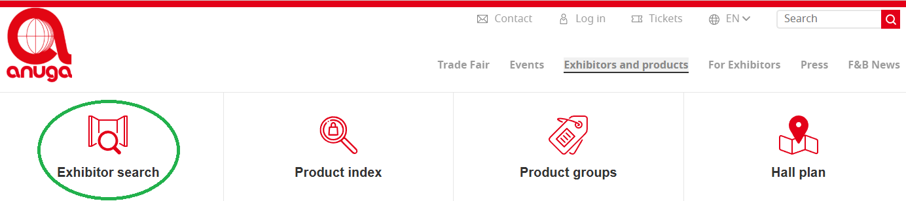

## 🤖 [Koelnmesse Exhibitor List Scraper](https://apify.com/skython/koelnmesse-exhibitor-list-scraper)

Simple web scraper for extracting exhibitor data from trade show exhibitor lists provided by **Koelnmesse**.

Easily scrape company profiles including **company details, websites, social media links, product groups, brands, and more**. 

Ideal for **B2B lead generation, market research, event networking, and competitive analysis**. 

Supports multiple Koelnmesse trade fair websites with a consistent HTML structure.

## 🎯 Supported Website Structure

This scraper is designed to extract data from exhibitor directories with the same HTML structure as the supported Koelnmesse exhibitor lists.

### ❓ How to identify a supported website:

✅ The page URL usually ends with `/list-of-exhibitors/`.

✅ There should be an `Exhibitor Search` option under one of the menus (like in the image).

✅ Exhibitor listing page format should be the same as the sample websites below.

💡 **If you are unsure whether your target event is supported,** you can run a test with the URL — if no results are returned, the website is not compatible.

## 🌐 Supported Koelnmesse Events (Exhibitor Lists)

**Note:** *The following list includes Koelnmesse exhibitor directory URLs that have been tested so far. Other Koelnmesse or different events with the same website structure may also be supported.*

- [Anuga 2025 Exhibitor List](https://www.anuga.com/anuga-exhibitors/list-of-exhibitors/)

- [Anuga FoodTec 2024 Exhibitor List](https://www.anugafoodtec.com/anuga-foodtec-exhibitors/list-of-exhibitors/)

- [Aquanale 2025 Exhibitor List](https://www.aquanale.com/aquanale-exhibitors/list-of-exhibitors/)

- [Asia-Pacific Sourcing 2025 Exhibitor List](https://www.asia-pacificsourcing.com/aps-exhibitors/list-of-exhibitors/)

- [Didacta Cologne 2024 Exhibitor List](https://www.didacta-cologne.com/didacta-exhibitors/list-of-exhibitors/)

- [Eisenwarenmesse 2024 Exhibitor List](https://www.eisenwarenmesse.com/eisenwarenmesse-exhibitors/list-of-exhibitors/)

- [FSB Cologne 2025 Exhibitor List](https://www.fsb-cologne.com/fsb-exhibitors/list-of-exhibitors/)

- [h+h Cologne 2025 Exhibitor List](https://www.hh-cologne.com/hh-cologne-exhibitors/list-of-exhibitors/)

- [Intermot Cologne 2024 Exhibitor List](https://www.intermot-cologne.com/intermot-exhibitors/list-of-exhibitors/)

- [Interzum 2025 Exhibitor List](https://www.interzum.com/en/interzum-exhibitors/list-of-exhibitors/)

- [ISM Cologne 2025 Exhibitor List](https://www.ism-cologne.com/ism-cologne-exhibitors/list-of-exhibitors/)

- [Kind + Jugend 2025 Exhibitor List](https://www.kindundjugend.com/kindundjugend-exhibitors/list-of-exhibitors/)

- [Orgatec 2024 Exhibitor List](https://www.orgatec.com/orgatec-exhibitors/list-of-exhibitors/)

- [ProSweets Cologne 2025 Exhibitor List](https://www.prosweets.com/psc-exhibitors/list-of-exhibitors/)

- [Spoga+Gafa 2025 Exhibitor List](https://www.spogagafa.com/spoga-gafa-exhibitors/list-of-exhibitors/)

- [Spoga Horse 2026 Exhibitor List](https://www.spogahorse.com/spoga-horse-exhibitors/list-of-exhibitors/)

- [The Tire Cologne 2025 Exhibitor List](https://www.thetire-cologne.com/ttc-exhibitors/list-of-exhibitors/)

- [IDS(International Dental Show) 2025 Exhibitor List](https://www.english.ids-cologne.de/ids-cologne-exhibitors/list-of-exhibitors/)

## 👇 Check My Other Exhibitor List Scrapers

- [Messe Frankfurt Exhibitor List Scraper](https://apify.com/skython/messe-frankfurt-exhibitor-list-scraper)

- [Map Your Show Exhibitor List Scraper](https://apify.com/skython/map-your-show-exhibitor-list-scraper)